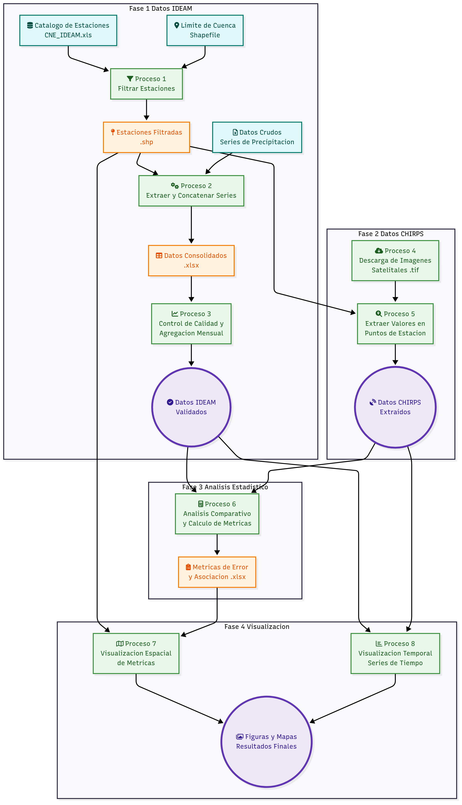

# Análisis de Precipitación en la Cuenca del Orinoco: Comparación de datos IDEAM y CHIRPS

Este repositorio contiene una serie de scripts en formato de Jupyter Notebooks y los datos asociados, diseñados para llevar a cabo un análisis comparativo de la precipitación en la cuenca del Orinoco. El estudio se enfoca en la validación de los datos del producto satelital CHIRPS (Climate Hazards Group InfraRed Precipitation with Station data) frente a los registros de estaciones en tierra del IDEAM (Instituto de Hidrología, Meteorología y Estudios Ambientales) para el período comprendido entre 1981 y 2024.

## Tabla de Contenidos

- [Descripción del Proyecto](#descripción-del-proyecto)
- [Estructura del Repositorio](#estructura-del-repositorio)
- [Flujo de Trabajo](#flujo-de-trabajo)
- [Requisitos](#requisitos)
- [Uso](#uso)
- [Resultados](#resultados)
- [Visualizaciones](#visualizaciones)

## Descripción del Proyecto

El objetivo principal de este proyecto es evaluar la precisión y fiabilidad de los datos de precipitación mensual del producto CHIRPS en la región de la Orinoquia colombiana. Para ello, se realiza una comparación exhaustiva con los datos históricos de precipitación recolectados por las estaciones meteorológicas del IDEAM. El análisis incluye la descarga, procesamiento, filtrado y análisis estadístico de ambas fuentes de datos, culminando con la generación de visualizaciones espaciales y temporales que facilitan la interpretación de los resultados.

## Estructura del Repositorio

El repositorio está organizado en las siguientes carpetas y archivos principales:

- **`*.ipynb`**: Jupyter Notebooks que contienen el código para cada paso del análisis. Están numerados para indicar el orden de ejecución.
- **`area_de_estudio/`**: Contiene los archivos geoespaciales que definen el área de estudio, como el shapefile de la cuenca del Orinoco.
- **`datos_chirps/`**: Carpeta destinada a almacenar las imágenes de precipitación en formato GeoTIFF. **Nota:** Debido a su gran tamaño, los datos crudos no se incluyen en este repositorio. Pueden ser descargados desde el siguiente enlace de Google Drive: [Descargar Datos CHIRPS](https://drive.google.com/drive/folders/1aPQPb-F8TXuX1WhXIET2FuHhTG-bw-z8?usp=sharing).
- **`datos_ideam/`**: Carpeta destinada a contener los datos crudos de precipitación de las estaciones del IDEAM. **Nota:** Debido a su tamaño, los datos no se incluyen en este repositorio. Pueden ser descargados desde el siguiente enlace: [Descargar Datos IDEAM](https://drive.google.com/file/d/1N1J6l4jktp6G4JX9P-qNMZWr9Iob6Oos/view?usp=sharing).
- **`datos_analisis/`**: Carpeta con los datos ya procesados y listos para el análisis estadístico, como las series de tiempo mensuales de precipitación para ambas fuentes.
- **`figuras/`**: Guarda todas las figuras y mapas generados durante el análisis, como los mapas de correlación y error.
- **`shp/`**: Contiene archivos shapefile adicionales utilizados o generados durante el proceso.
- **`validacion/`**: Almacena los resultados numéricos de la validación, como las tablas con los coeficientes de correlación, R², p-values y métricas de error (BIAS, MAD, RMSE).

## Flujo de Trabajo

A continuación, se presenta un diagrama que resume el flujo de trabajo completo del proyecto, desde la adquisición de datos hasta la generación de resultados y visualizaciones.

El análisis se desarrolla a través de los siguientes notebooks, que deben ser ejecutados en orden:

1.  **`1_estaciones_ideam.ipynb`**: Identifica y filtra las estaciones del IDEAM que se encuentran dentro del área de la cuenca del Orinoco.
2.  **`2_extraer_datos_ideam.ipynb`**: Extrae las series de tiempo de precipitación para las estaciones seleccionadas a partir de los datos crudos.
3.  **`3_filtro_ideam.ipynb`**: Aplica un filtro a las estaciones para asegurar que tengan un porcentaje mínimo de datos disponibles (40%) en el período de análisis (1981-2024), y genera el archivo de precipitación mensual del IDEAM.
4.  **`4_descargar_imagenes_chirps.ipynb`**: Descarga las imágenes de precipitación mensual de CHIRPS para el período de estudio.
5.  **`5_extraer_datos_chirps.ipynb`**: Extrae los valores de precipitación de las imágenes CHIRPS para las ubicaciones de las estaciones del IDEAM.
6.  **`6_analisis_estadistico.ipynb`**: Realiza el análisis estadístico comparativo, incluyendo:
    -   Correlación de Spearman y coeficiente de determinación (R²).
    -   Pruebas de diferencia estadística (U de Mann-Whitney y t-Student) para cada mes.
    -   Cálculo de métricas de error: BIAS, Desviación Absoluta Media (MAD) y Raíz del Error Cuadrático Medio (RMSE).
7.  **`7_visualizacion_espacial_asociacion.ipynb`**: Genera mapas de intensidad para visualizar espacialmente la correlación y el R² en la cuenca.
8.  **`7_visualizacion_espacial_error.ipynb`**: Crea mapas de intensidad para visualizar el BIAS y el RMSE, permitiendo identificar zonas con mayor o menor error.
9.  **`9_visualizacion_temporal.ipynb`**: Genera gráficos temporales, como diagramas de violín y gráficos de barras, para analizar la distribución de los p-values y la significancia de las diferencias a lo largo de los meses.

## Requisitos

Para ejecutar los scripts de este repositorio, es necesario tener un entorno de Python con las siguientes librerías instaladas:

-   `pandas`
-   `geopandas`
-   `matplotlib`
-   `requests`
-   `rasterio`
-   `scipy`
-   `seaborn`

Se recomienda utilizar un gestor de entornos como `conda` o `venv` para manejar las dependencias.

## Uso

Para reproducir el análisis, sigue los siguientes pasos:

1.  Clona o descarga este repositorio en tu máquina local.
2.  Asegúrate de tener instaladas todas las librerías listadas en la sección de [Requisitos](#requisitos).
3.  Ejecuta los Jupyter Notebooks en el orden numérico establecido, desde el `1` hasta el `9`.

Cada notebook está documentado para explicar el propósito de cada paso del proceso.

## Resultados

Los resultados cuantitativos del análisis se almacenan en la carpeta **`validacion/`**. Estos archivos Excel contienen:

-   **`analisis-asociacion-estaciones.xlsx`**: Coeficientes de correlación y R² para cada estación.
-   **`analisis_diferencia_U_Mann_Whitney.xlsx`**: P-values de la prueba U de Mann-Whitney.
-   **`analisis_diferencia_ttest.xlsx`**: P-values de la prueba t-Student.
-   **`analisis-error.xlsx`**: Métricas de error (BIAS, MAD, RMSE) para cada estación.
-   **`resumen_significancia_conteo.xlsx`**: Tabla resumen con el conteo de estaciones con diferencias significativas por mes.

## Visualizaciones

Todas las figuras y mapas generados se guardan en la carpeta **`figuras/`**. Estas visualizaciones incluyen:

-   Mapas de distribución espacial de las estaciones.
-   Mapas de intensidad de correlación, R², BIAS y RMSE.
-   Gráficos de violín y de barras para el análisis de significancia temporal.